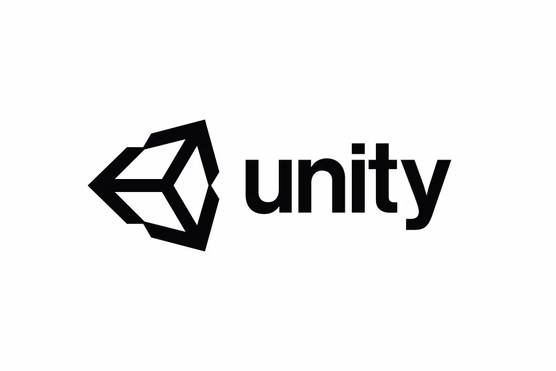

<!-- TOC -->

- [Unity学习-01-游戏引擎基础](#unity学习-01-游戏引擎基础)
  - [1.1 概述](#11-概述)
  - [1.2 Unity游戏引擎简介](#12-unity游戏引擎简介)

<!-- /TOC -->

# Unity学习-01-游戏引擎基础

## 1.1 概述
学习如何使用unity3D游戏引擎开发游戏
发展趋势：
- **专注特定功能**
  - 物理引擎 PhysX
  - 植被系统 SpeedTree
  - 语音聊天 VIVOX
- 集成众多功能
  - UnrealEngine
  - CryEngine
  - Unity3D
  - GODOT

## 1.2 Unity游戏引擎简介
